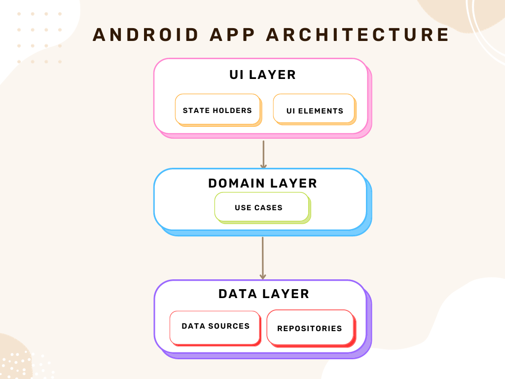

# AndroidMyMemosMVI
 Android App is written in Kotlin, UI with Jetpack Compose,  MVI architecture | Clean code structure | Unidirectional Data Flow | Clear separation of concerns

## /feature 
### - data
### - domain
### - ui

  


## What is included: Coroutines, Hilt, Modern Architecture Components, UDF, Room, Material Components, Accompanist Lib and more.
* **Unidirectional Data Flow**: Ensuring a consistent and predictable behavior.
* **MVI Pattern:** A robust pattern that simplifies user interactions and data updates.
* **Domain Layer**: An optional layer that encapsulates all the business logic, making the app robust and efficient, making the app's core functions clear and concise.
The UI is done with simplicity, in the Neobrutalism style, as the focus and the emphasis are placed on robust and clean project architecture. 
# Technologies used 📚
- [Kotlin](https://kotlinlang.org/) - Kotlin is an official programming language for Android development.
- [Jetpack Compose](https://developer.android.com/jetpack/compose) - Jetpack Compose is Android’s recommended modern toolkit for building native UI. 

### Libraries 📚


* [Navigation](https://developer.android.com/jetpack/compose/navigation)
* [Location](https://developer.android.com/training/location)
* [Hilt](https://developer.android.com/training/dependency-injection/hilt-android)
* [Room](https://developer.android.com/jetpack/androidx/releases/room)
* [Accompanist](https://google.github.io/accompanist/insets/)
   <br/>
  
## Architecture 🏗️
* Modern App (recommended) architecture - UDF, and an MVI pattern.
* ### Data, Domain, and UI Layer.

   

* Learn more about the recommended [Modern App Architecture](https://developer.android.com/topic/architecture) in the offical Google's documentation.


 ## ✍️ Contact 
<a href="mailto:greencodeinnovations@gmail.com?"></a>
 <br/>
## 📝 License
```
MIT License

Copyright (c) 2023 Natasa Misic

Permission is hereby granted, free of charge, to any person obtaining
a copy of this software and associated documentation files (the "Software"), 
to deal in the Software without restriction, including without limitation the
rights to use, copy, modify, merge, publish, distribute, sublicense, and/or 
sell copies of the Software, and to permit persons to whom the Software is
furnished to do so, subject to the following conditions:

The above copyright notice and this permission notice shall be included 
in all copies or substantial portions of the Software.

THE SOFTWARE IS PROVIDED "AS IS", WITHOUT WARRANTY OF ANY KIND, EXPRESS OR IMPLIED,
INCLUDING BUT NOT LIMITED TO THE WARRANTIES OF MERCHANTABILITY, FITNESS FOR A 
PARTICULAR PURPOSE AND NONINFRINGEMENT. IN NO EVENT SHALL THE AUTHORS OR COPYRIGHT
HOLDERS BE LIABLE FOR ANY CLAIM, DAMAGES OR OTHER LIABILITY, WHETHER IN AN ACTION OF
CONTRACT, TORT OR OTHERWISE, ARISING FROM, OUT OF OR IN CONNECTION WITH THE SOFTWARE
OR THE USE OR OTHER DEALINGS IN THE SOFTWARE.
```


