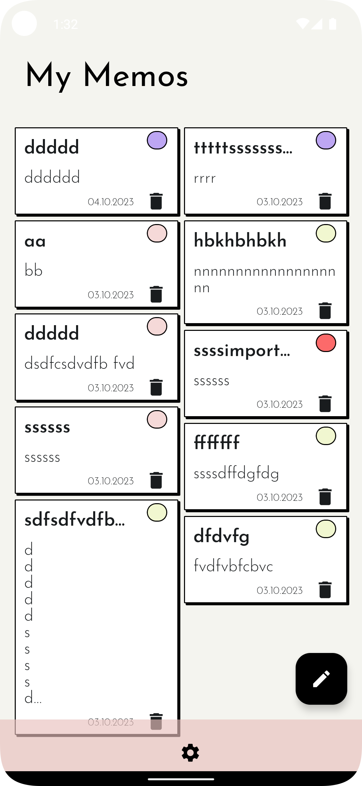

# AndroidMyMemosMVI
 Android App is written in Kotlin, UI with Jetpack Compose,  MVI architecture | Clean code structure | Unidirectional Data Flow | Clear separation of concerns

## /feature 
### - data
### - domain
### - ui

  

## What is included: Coroutines, Hilt, Modern Architecture Components, UDF, Room, Material Components, Accompanist Lib and more.
* **Unidirectional Data Flow**: Ensuring a consistent and predictable behavior.
* **MVI Pattern:** A robust pattern that simplifies user interactions and data updates.
* **Domain Layer**: An optional layer that encapsulates all the business logic, making the app robust and efficient, making the app's core functions clear and concise.
The UI is done with simplicity, in the Neobrutalism style, as the focus and the emphasis are placed on robust and clean project architecture. 
# Technologies used 📚
- [Kotlin](https://kotlinlang.org/) - Kotlin is an official programming language for Android development.
- [Jetpack Compose](https://developer.android.com/jetpack/compose) - Jetpack Compose is Android’s recommended modern toolkit for building native UI. 

### Libraries 📚

* [Navigation](https://developer.android.com/jetpack/compose/navigation)
* [Location](https://developer.android.com/training/location)
* [Hilt](https://developer.android.com/training/dependency-injection/hilt-android)
* [Room](https://developer.android.com/jetpack/androidx/releases/room)
* [Accompanist](https://google.github.io/accompanist/insets/)
    
  
## Architecture 🏗️
* Modern App (recommended) architecture - UDF, and an MVI pattern.
* ### Data, Domain, and UI Layer.
* Learn more about the recommended [Modern App Architecture](https://developer.android.com/topic/architecture) .

  
   
